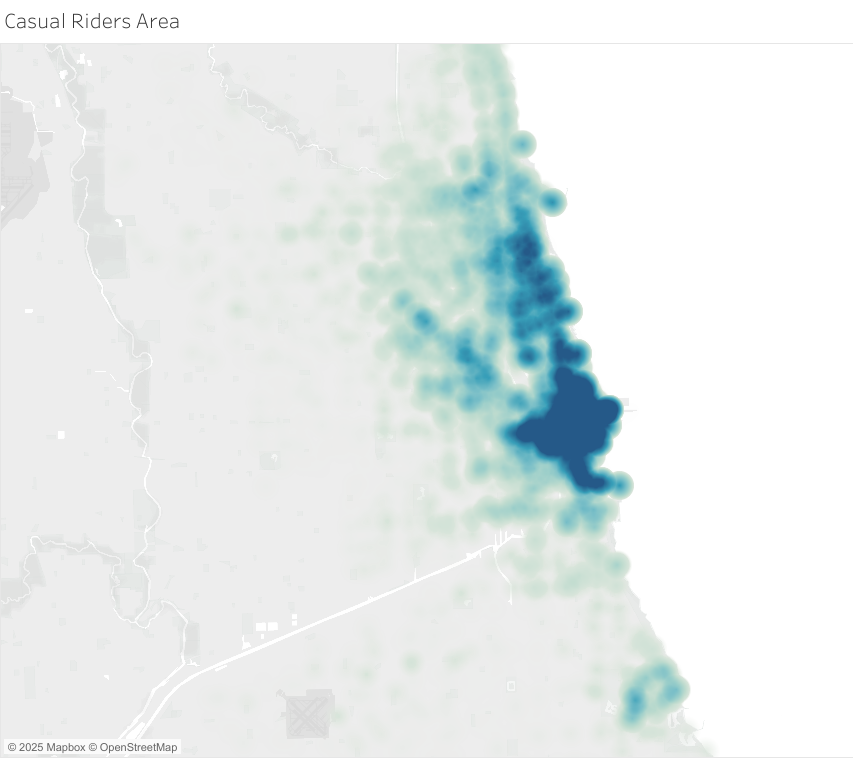
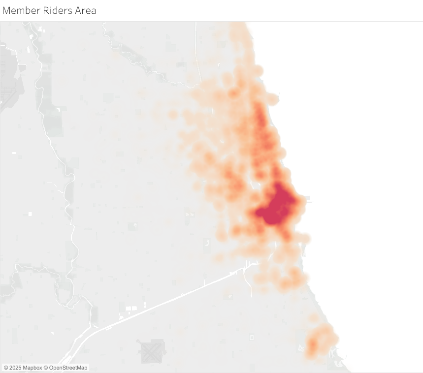

# Project Bike Share - Case Study
*Fictional company with real data - practice data analysis project*

## Background
I am working as a junior analyst working in the marketing analyst team at company C, a bike-share company in Chicago. The director of marketing believes the company's future success depends on maximising the number of annual memberships. Therefore, my team wants to understand how casual riders and annual members use bikes differently. From the insights, new marketing strategies can be designed to convert casual riders into annual members.

## Assigned task (question to answer)
How do annual members and casual riders use bikes differently?

## Findings
Analysis of the past 12 months of trip data reveals distinct usage patterns between casual and member riders:

- **Temporal Usage Patterns**: Casual riders exhibit a pronounced tendency to utilise the bike-sharing service for leisure and relaxation, with peak activity observed on weekend afternoons, particularly on Saturdays, and often along the shoreline. In contrast, member riders demonstrate consistent usage throughout the week, frequently within inner-city areas, suggesting a greater reliance on the service for weekday commuting or regular transportation needs. Furthermore, seasonal trends indicate that casual rider activity is significantly higher during the summer months, whereas member ridership experiences a relative decrease during winter.
- **Trip Duration Characteristics**: While both user groups predominantly undertake short trips, casual riders tend to have slightly longer average trip durations, typically ranging between 6 to 16 minutes. Member trips, on the other hand, are generally somewhat shorter, with a common duration of 5 to 13 minutes. This subtle difference may reflect the differing purposes of their rides, with casual riders potentially engaging in more leisurely explorations.

In summary, casual ridership appears to be strongly correlated with recreational activities during peak leisure times and seasons, while member usage suggests a more consistent and potentially utilitarian purpose, particularly during the work week within urban centre. These distinctions provide valuable insights for tailoring marketing strategies aimed at converting casual users into long-term members.

## Data Exploration
Loading all the packages needed for the data exploration
```{r message=FALSE, warning=FALSE}
library('tidyverse')
library('tidymodels')
library('viridis')
library('psych')
library('rmarkdown')

# Prevents scientific figures appearance on the chart, for instance
options(scipen = 999)
```
Loading the data
```{r include=FALSE}
trip_202403_202502_rmd <- read_csv('../data/processed/trip-202403-202502.csv')
```


## First discovery: missing data
Access was granted to bike-share trip data spanning the period from March 2024 to February 2025, encompassing a total of 5,783,100 individual ride records. Initial data exploration revealed the presence of missing values across key variables, specifically start station (18.68%), end station (19.20%), and end coordinates (0.12%).

While the proportion of missing end coordinate data can be considered negligible, the substantial absence of start and end station information presents a notable challenge. A complete case analysis through simple omission of these records would likely compromise the discovery of valuable insights and potentially introduce bias.

Therefore, recognising the significant volume of missing station data, further investigation into the characteristics and potential origins of these omissions may yield valuable insights into data collection processes or specific usage patterns associated with unrecorded station information.

**Missing data of Start Station**

```{r echo=FALSE}
trip_202403_202502_rmd |> 
  filter(is.na(start_station_name)) |> 
  select(rideable_type, member_casual) |> 
  ggplot(aes(rideable_type, fill = member_casual)) +
  geom_bar() +
  scale_fill_viridis(discrete = TRUE, option = 'viridis') +
  facet_wrap(~member_casual) +
  labs(
    title = 'Lots of missing data on Electric Rides',
    subtitle = 'Missing data - start_station_name',
    x = 'Type of rides',
    y = 'Frequency',
    caption = 'Data between Mar 2024 to Feb 2025'
  )
```

**Missing data of End Station**

```{r echo=FALSE}
trip_202403_202502_rmd |> 
  filter(is.na(end_station_name)) |> 
  select(rideable_type, member_casual) |> 
  ggplot(aes(rideable_type, fill = member_casual)) +
  geom_bar() +
  scale_fill_viridis(discrete = TRUE, option = 'viridis') +
  facet_wrap(~member_casual) +
  labs(
    title = 'Majority of missing data on Electric Rides',
    subtitle = 'Missing data - end_station_name',
    x = 'Type of rides',
    y = 'Frequency',
    caption = 'Data between Mar 2024 to Feb 2025'
  )
```

**Missing data of End Coordinate**

```{r echo=FALSE}
trip_202403_202502_rmd |> 
  filter(is.na(end_lat)) |> 
  select(rideable_type, member_casual) |> 
  ggplot(aes(rideable_type, fill = member_casual)) +
  geom_bar() +
  scale_fill_viridis(discrete = TRUE, option = 'viridis') +
  facet_wrap(~member_casual) +
  labs(
    title = 'Almost all the missing data are from traditional bikes',
    subtitle = 'Missing data - end_lat',
    x = 'Type of rides',
    y = 'Frequency',
    caption = 'Data between Mar 2024 to Feb 2025'
  )
```

Further analysis of the missing data patterns reveals distinct associations with ride type. A significant proportion of missing start and end station information appears to be correlated with electric bike usage during the registration process. Conversely, for classic bike trips, the primary data integrity issue seems to be the incomplete recording of end coordinates.

Based on these findings, it is recommended to implement targeted investigations into the data capture mechanisms for each bike type. Specifically, a review of the device and system processes involved in registering start and end station details for electric bikes is warranted. Simultaneously, a focused assessment of the data recording procedures for end coordinates on classic bikes should be undertaken. Addressing these specific points of failure has the potential to significantly improve the completeness and reliability of our core trip data, thereby enhancing the foundation for future analysis.

## Main findings
### Popular areas Member VS Casual riders

The available start and end station data offer valuable spatial insights into the usage patterns of different rider types. Analysis of these data suggests a discernible preference among casual riders for routes along the shoreline, coastal areas, and in the vicinity of parks and local attractions, as indicated by the popular start and end stations.

```{r echo=FALSE}
trip_202403_202502_rmd |> 
  filter(!is.na(start_station_name), member_casual == 'casual') |> 
  select(start_station_name) |> 
  count(start_station_name) |> 
  slice_max(n, n=20) |> 
  ggplot(aes(fct_reorder(start_station_name,n),n)) +
  geom_col(fill = "#440154") +
  coord_flip() +
  geom_hline(yintercept = 20000, linetype = 'dashed', colour = '#21918c') +
  annotate('rect', 
           xmin = 14.5, 
           xmax = 20.5, 
           ymin = -500, 
           ymax = 51000, 
           colour = '#21918c', 
           alpha = 0) +
  labs(
    title = 'Top 20 Start Stations for Casual Riders',
    x = 'Station Name',
    y = 'Frequency',
    caption = 'Data between Mar 2024 to Feb 2025'
  )
```

```{r echo=FALSE}
trip_202403_202502_rmd |> 
  filter(!is.na(end_station_name), member_casual == 'casual') |> 
  select(end_station_name) |> 
  count(end_station_name) |> 
  slice_max(n, n=20) |> 
  ggplot(aes(fct_reorder(end_station_name, n), n)) +
  geom_col(fill = '#440154') +
  coord_flip() +
  geom_hline(yintercept = 20000, linetype = 'dashed', colour = '#21918c') +
  annotate('rect', 
           xmin = 15.5, 
           xmax = 20.5, 
           ymin = -500, 
           ymax = 55000, 
           colour = '#21918c', 
           alpha = 0) +
  labs(
    title = 'Top 20 End Stations for Casual Riders',
    x = 'Station Name',
    y = 'Frequency',
    caption = 'Data between Mar 2024 to Feb 2025'
    )
```




Conversely, member riders exhibit significant service utilisation within inner-city areas, suggesting a broader range of travel purposes beyond leisure-focused locations.

```{r echo=FALSE}
trip_202403_202502_rmd |> 
  filter(!is.na(start_station_name), member_casual == 'member') |> 
  select(start_station_name) |> 
  count(start_station_name) |> 
  slice_max(n, n=20) |> 
  ggplot(aes(fct_reorder(start_station_name,n),n)) +
  geom_col(fill = "#fde725") +
  coord_flip() +
  geom_hline(yintercept = 20000, linetype = 'dashed', colour = '#21918c') +
  labs(
    title = 'Top 20 Start Stations for Members',
    x = 'Station Name',
    y = 'Frequency',
    caption = 'Data between Mar 2024 to Feb 2025'
  )
```

```{r echo=FALSE}
trip_202403_202502_rmd |> 
  filter(!is.na(end_station_name), member_casual == 'member') |> 
  select(end_station_name) |> 
  count(end_station_name) |> 
  slice_max(n, n=20) |> 
  ggplot(aes(fct_reorder(end_station_name, n), n)) +
  geom_col(fill = '#fde725') +
  coord_flip() +
  geom_hline(yintercept = 20000, linetype = 'dashed', colour = '#21918c') +
  labs(
    title = 'Top 20 End Stations for Members',
    x = 'Station Name',
    y = 'Frequency',
    caption = 'Data between Mar 2024 to Feb 2025'
  )
```




### Trend on **WHEN** Member VS Causal Riders
#### Monthly and Seasonal Difference

Temporal analysis reveals a seasonal divergence in ridership patterns. Casual ridership demonstrates a strong positive relation with the summer months, indicating a higher propensity for using the service during warmer periods. In contrast, member ridership exhibits a more consistent pattern throughout the year, albeit with a noticeable decrease in usage during periods of low temperatures or the winter season.

```{r echo=FALSE, warning=FALSE}
trip_202403_202502_rmd |> 
  select(month, member_casual) |> 
  ggplot(aes(month, fill = member_casual)) +
  geom_bar() +
  facet_wrap(~member_casual) +
  scale_x_continuous(breaks = seq(1,12,1)) +
  scale_fill_viridis(discrete = TRUE, option = 'viridis') +
  labs(
    title = 'Casual riders tend to use the service more from Jun to Sep',
    x = 'Month',
    y = 'Frequency',
    caption = 'Data between Mar 2024 to Feb 2025'
  )
```

#### Weekly perspective

```{r echo=FALSE, warning=FALSE}
trip_202403_202502_rmd |> 
  ggplot(aes(wk, fill = member_casual)) +
  geom_bar() +
  facet_wrap(~member_casual) +
  scale_fill_viridis(discrete = TRUE, option = 'viridis') +
  labs(
    title = 'Weekend for the Casuals, while members use them ever so often',
    x = 'Day of the week',
    y = 'Frequency',
    caption = 'Data between Mar 2024 to Feb 2025'
  )
```

#### Month & Weeks

```{r echo=FALSE, warning=FALSE}
trip_202403_202502_rmd |> 
  filter(member_casual == 'casual') |> 
  ggplot(aes(x = factor(wk, levels = c('Mon',
                                       'Tue',
                                       'Wed',
                                       'Thu',
                                       'Fri',
                                       'Sat',
                                       'Sun')))) +
  geom_bar(fill = '#440154') +
  facet_wrap(~ month, ncol = 4) +
  theme(axis.text.x = element_text(size = 7)) +
  labs(
    title = 'Causal riders are most active from Jun to Sep',
    x = 'Week days in different months',
    y = 'Frequency',
    caption = 'Data between Mar 2024 to Feb 2025'
  )
```

```{r echo=FALSE, warning=FALSE}
trip_202403_202502_rmd |> 
  filter(member_casual == 'member') |> 
  ggplot(aes(x = factor(wk, levels = c('Mon',
                                       'Tue',
                                       'Wed',
                                       'Thu',
                                       'Fri',
                                       'Sat',
                                       'Sun')))) +
  geom_bar(fill = '#fde725') +
  facet_wrap(~ month, ncol = 4) +
  theme(axis.text.x = element_text(size = 7)) +
  labs(
    title = 'Members only use it less in Winter',
    x = 'Week days in different months',
    y = 'Frequency',
    caption = 'Data between Mar 2024 to Feb 2025'
  )
```

### Travel Time Period
Analysis of trip duration indicates that while both casual and member riders predominantly undertake short journeys, casual riders exhibit a tendency for slightly longer average trip durations (Casual Riders: *6-16 minutes*, Member Riders: *5-13 minutes*) compared to their member counterparts.

```{r echo=FALSE, warning=FALSE}
trip_202403_202502_rmd |> 
  filter(duration_min >= 0 & duration_min < 30) |> 
  ggplot(aes(member_casual, duration_min, fill = member_casual)) +
  geom_boxplot(colour = '#5ec962') + 
  scale_fill_viridis(discrete = TRUE, option = 'viridis') +
  labs(
    title = 'Duration Boxplot Causal VS Member',
    x = 'Type of riders',
    y = 'Duration in  minutes',
    caption = 'Data from Mar 2024 to Feb 2025'
  )
```

## Recommendation
In pursuit of our strategic objective to convert casual riders into valued members, the preceding findings provide a robust foundation for targeted recommendations:

- **Strategic Digital Marketing Placement**: To effectively reach and engage casual riders, digital marketing efforts should strategically prioritise coverage of shoreline and local attraction areas, particularly during the summer season and specifically on Saturdays in the afternoon, for instance. This targeted geographic and temporal focus aligns with the observed peak activity of this user segment.
- **Compelling Digital Content Messaging**: Marketing content disseminated through digital channels should effectively communicate the multifaceted benefits of membership. This messaging should emphasise:
  - *Economic and Environmental Advantages*: Highlight the cost-effectiveness and environmentally sustainable nature of bike-sharing as a transportation alternative.
  - *Versatility Beyond Leisure*: Underscore the utility of bike-sharing not only for recreational exploration but also as a convenient and efficient mode of daily commuting and travel to work, especially in the city like Chicago.
  - *Cost-saving Promotions*: To further enhance the potential for converting casual riders to members, the digital content may also incorporate compelling promotional offers, specifically highlighting the value proposition of annual membership packages. Emphasising the significant cost savings afforded by these packages can serve as a strong incentive for casual riders to transition to a membership model. *It is understood that the development and implementation of any promotional program will be contingent upon careful consideration of the marketing department's budgetary constraints*.
  
By implementing these recommendations, we can strategically position our marketing initiatives to resonate with casual riders, effectively showcasing the compelling advantages of membership and driving successful conversion.